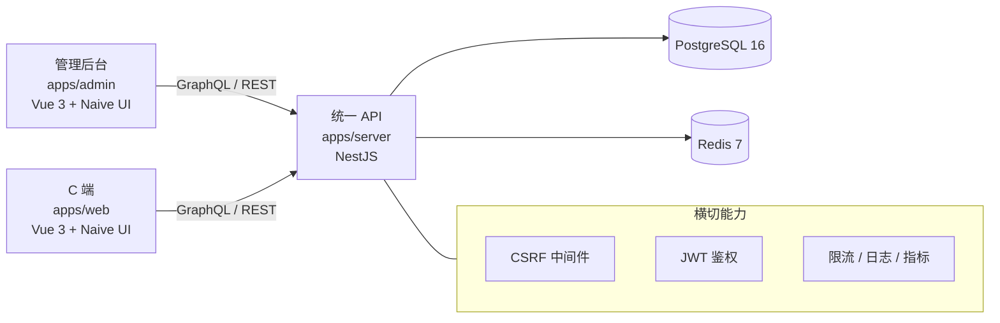

# MonoKit — 开源企业级全栈基座

> **不重复造轮子，只造一次底座。** 认证、鉴权、RBAC、CSRF、限流、缓存、审计、文件上传一次写齐，你只管写业务。MIT 开源，fork 即用。

[](./LICENSE)
[](./package.json)
[](./package.json)
[](./.github/workflows/ci.yml)
[](./docs/ARCHITECTURE.md)

---

## 截图预览

> 截图由本地 dev 环境下手动截取，素材位于 `docs/screenshots/`。

| 管理后台                                                   | C 端                                           |
| ---------------------------------------------------------- | ---------------------------------------------- |
|          |  |
|  |    |
|          |                                                |
|          |                                                |

---

## 这是什么

**MonoKit 是一个开源的企业级全栈基座项目**（Starter Foundation），不是业务产品。

你拿到的不是"一个能跑的 App"，而是"一个新项目所需的全部底座代码"：

- **后端**：`apps/server` — NestJS 统一 API，GraphQL + REST 双协议
- **管理后台**：`apps/admin` — Vue 3 + Naive UI，权限 / 角色 / 菜单 / 审计全跑通
- **C 端**：`apps/web` — Vue 3 + Naive UI，短信 / 账号 / 第三方登录
- **共享**：`packages/*` — Zod schema、ESLint/TS 配置、Git hooks

> 思路：**不重复造轮子，只造一次底座。** 新建项目时，fork 这一个仓库，删掉业务代码，保留基础设施，开始写你的业务。

---

## 核心思想

### 1. 开源基座，**不是产品**

MonoKit 的目标不是成为某一个 SaaS，而是成为**所有 NestJS + Vue 3 中后台项目的底座**。

- ✅ 你 fork 它，**改 package 名为你的项目**，删掉 `apps/admin` / `apps/web` 里你不需要的页面
- ✅ 你不需要感谢我们，不需要保留我们品牌，不需要回 PR
- ✅ 这就是开源的基座应该有的样子：**把重复的基础设施写一次，剩下是你的**

### 2. 0 → 1 绿色项目

没有历史包袱。所有技术选型都追求"当前最新"而非"历史兼容"。

- 旧版 API 兼容？不需要
- 存量数据迁移？不需要
- 遗留代码重构？不需要

> **尝鲜优先**（Latest-First）。引入任何 npm 包之前，先看它的最新稳定版和当前推荐 API。每次见到一个库，都重新审视一次。

### 3. 通用性 > 业务特化

代码追求**通用性、可复用性、文档完备性**——写的时候想清楚别人怎么用。

- 命名规范统一（见 [开发文档/命名规范.md](./开发文档/命名规范.md)）
- 每个公共 API 都有中文注释和单元测试
- 每个 module 都有 README 解释为什么这样设计

### 4. 文档驱动

不是"先写代码再补文档"，而是"先想清楚写文档再写代码"。

- 架构变更前先写 design doc
- API 改动先更新 schema 文档
- 安全策略先写威胁模型

---

## 适合谁

MonoKit 不是"一个 Vue 模板"或"一个 NestJS Demo"，它适合：

| 适合                                 | 不适合                       |
| ------------------------------------ | ---------------------------- |
| 计划长期演进的中大型项目             | 临时 PoC / 一次性的 Demo     |
| 重视代码质量和安全合规的团队         | 追求最快搭起来不管后续的团队 |
| 想跳过"搭架子"阶段直接写业务的团队   | 想自己从零学习基础架构的团队 |
| 需要管理后台 + C 端 + 后端的完整方案 | 只需要后端 API 或只需要前端  |

如果你只是想搭一个简单的个人博客，**用 Nuxt / Next 比用 MonoKit 合适**。如果你正在启动一个要活 3-5 年的产品，**MonoKit 会帮你省下前 3 个月的搭架子时间**。

---

## 核心特性

| 类别     | 选型              | 说明                                    |
| -------- | ----------------- | --------------------------------------- |
| 后端框架 | NestJS            | 最新稳定版，模块化分层                  |
| ORM      | Prisma            | 最新稳定版，UUID v7 主键 + 软删除扩展   |
| 验证     | Zod               | Schema 驱动，前后端共享                 |
| 限流     | @nestjs/throttler | 命名限流器，按 IP / 用户 / 路由灵活配置 |
| 日志     | nestjs-pino       | 结构化日志，按请求 ID 串联              |
| 缓存     | ioredis           | 两级缓存（角色级 + 账户级）             |
| 测试     | Vitest            | 后端默认测试框架                        |
| 前端框架 | Vue 3             | Composition API + `<script setup>`      |
| UI 库    | Naive UI          | 复杂组件（DataTable / Form / Modal）    |
| 样式     | Tailwind CSS      | 优先 utility classes                    |
| API 协议 | GraphQL + REST    | GraphQL 为主，REST 仅用于认证           |

---

## 文案规范

- **唯一目标语言**：简体中文
- **不做国际化**（详见 [CLAUDE.md](./CLAUDE.md)）：所有用户可见文案（按钮、菜单、提示、表单 label / placeholder 等）一律直接硬编码中文
- 不引入 `vue-i18n` / `i18next` / 任何多语言库

---

## GraphQL Schema Artifact

CI / SDK 生成器 / 前端 codegen 需要稳定的 SDL 文件，而不是每次现场 bootstrap NestJS。本基座在 build 阶段生成 artifact 提交到 Git：

```bash
# 编译源码
pnpm -F @apps/server build

# 生成 dist/schema.gql（GraphQL SDL）+ dist/openapi.json（REST 端点描述）
pnpm -F @apps/server generate:schema

# CI 阶段：校验 artifact 与 HEAD 一致
pnpm -F @apps/server schema:check
```

| 文件                                              | 用途                                         |
| ------------------------------------------------- | -------------------------------------------- |
| `apps/server/dist/schema.gql`                     | GraphQL SDL，提交到 Git 供 codegen 消费      |
| `apps/server/dist/openapi.json`                   | REST 端点 OpenAPI 3.0 描述                   |
| `apps/server/scripts/generate-schema-artifact.ts` | 生成脚本（启动编译后的 AppModule，复制 SDL） |
| `apps/server/scripts/check-schema-artifact.ts`    | 漂移校验脚本（CI 闸门）                      |

dev 改了 GraphQL resolver 但没跑 `pnpm generate:schema`？CI 会立刻失败：

```
✗ Schema artifact 与 HEAD 不一致
可能原因：
  1. 改了 GraphQL resolver / Type 但没跑 pnpm generate:schema
  2. 跑了 pnpm generate:schema 但没把新 artifact 加入 commit
```

详细流程 / 错误处理 / 常见问题见 [apps/server/docs/GraphQL.md](./apps/server/docs/GraphQL.md)。

---

## 架构图



后端内置 CSRF、JWT 限流、结构化日志、Prometheus 指标等横切能力，统一在 NestJS 内部完成。

---

## 如何 fork 并定制

**这是 MonoKit 最核心的使用方式**——也是它和其他 Starter 模板最大的区别：

```bash
# 1. 克隆 MonoKit
git clone https://github.com/your-org/monokit.git my-project
cd my-project

# 2. 改包名
# 把 root package.json、apps/*/package.json、packages/*/package.json 里的
# "name" 字段全部改成 "@my-org/my-project-*"

# 3. 删掉你不需要的页面
# 比如你只做管理后台：
rm -rf apps/web

# 4. 安装 + 启动
pnpm install
docker compose up -d
cp apps/server/.env.example apps/server/.env
pnpm prisma migrate deploy
pnpm prisma db seed
pnpm dev

# 5. 开始写业务
# 删掉 apps/admin/src/features/iam/、apps/server/src/modules/admin/ 等示例模块
# 保留架构、安全、缓存、日志这些基础设施
```

**记住：MonoKit 是你的脚手架，不是你的产品。** 把它当一次性用品用——用完即扔，保留架构，删掉业务。

---

## 快速开始（直接跑通看看）

如果你只是想先看看 MonoKit 长什么样：

```bash
# 1. 安装依赖
pnpm install

# 2. 启动 Postgres + Redis
docker compose up -d

# 3. 配置环境变量
cp apps/server/.env.example apps/server/.env
# 编辑 .env，至少填 JWT_SECRET（用 openssl rand -hex 32 生成）

# 4. 初始化数据库
pnpm prisma migrate deploy
pnpm prisma db seed

# 5. 启动开发服务器（后端 + admin + web）
pnpm dev
```

访问入口：

- 管理后台：<http://localhost:5173>（默认账号 `root` / `Root!123`）
- C 端：<http://localhost:5174>
- API：<http://localhost:3000>
- GraphQL Playground：<http://localhost:3000/graphql>

---

## 功能矩阵

### 管理后台（apps/admin）

- **仪表盘**：系统概览、数据分析（Chart.js + ECharts）
- **权限控制**：管理员管理、角色管理、菜单管理
- **系统设置**：后台设置、审计日志、短信 / 邮件 / 存储服务、Turnstile 人机验证
- **运维面板**：缓存管理、操作日志
- **内置文档**：开发规范、命名规范、布局约定、FAQ

### C 端（apps/web）

- **首页**：产品 / 解决方案展示
- **会员内容**：普通会员 / VIP / SVIP 三级内容
- **个人中心**：资料管理、安全设置
- **登录方式**：短信验证码、账号密码、Turnstile 防护

---

## 目录结构

```
monokit/
├── apps/
│   ├── server/      NestJS 统一 API（GraphQL + REST）
│   ├── admin/       管理后台 Vue 3 SPA
│   └── web/         C 端 Vue 3 前端
├── packages/
│   ├── shared/      共享 Zod schema 与工具函数
│   └── config/      共享 ESLint / TS 配置
├── docs/            消费者技术文档（fork 后阅读）
└── 开发文档/        内部开发文档（设计决策、技术选型）
```

---

## 文档导航

### 消费者技术文档（`/docs/`，fork 后阅读）

- [docs/01-快速上手.md](./docs/01-快速上手.md) — 15 分钟跑通项目
- [docs/02-架构总览.md](./docs/02-架构总览.md) — 顶层目录、模块切分、调用关系
- [docs/03-模块参考.md](./docs/03-模块参考.md) — 14 个基座模块的职责与 API
- [docs/04-配置参考.md](./docs/04-配置参考.md) — 全部环境变量 + system_config 表
- [docs/05-扩展指南.md](./docs/05-扩展指南.md) — 加业务模块、改库、加权限、升级基座
- [docs/06-部署运维.md](./docs/06-部署运维.md) — 构建、镜像、生产编排、备份
- [docs/07-故障排查.md](./docs/07-故障排查.md) — 8 大类 30+ 个「症状 → 原因 → 解法」
- [docs/08-Changelog.md](./docs/08-Changelog.md) — 版本基线 + 升级指南 + 兼容性承诺

### 内部开发文档（`/开发文档/`，设计与决策依据）

- [开发文档/项目总览.md](./开发文档/项目总览.md) — 基座定位与设计原则
- [开发文档/技术架构.md](./开发文档/技术架构.md) — 各端技术栈与分层
- [开发文档/权限控制.md](./开发文档/权限控制.md) — RBAC 与缓存设计
- [开发文档/安全防护.md](./开发文档/安全防护.md) — CSRF / XSS / 限流 / Helmet
- [开发文档/缓存设计.md](./开发文档/缓存设计.md) — 两级缓存与失效策略
- [开发文档/API设计规范.md](./开发文档/API设计规范.md) — GraphQL + REST 双协议
- [开发文档/前端开发规范.md](./开发文档/前端开发规范.md) — Vue 3 + Naive UI + Tailwind
- [开发文档/测试策略.md](./开发文档/测试策略.md) — 单元 / e2e / 覆盖率
- [开发文档/部署运维.md](./开发文档/部署运维.md) — Docker / Nginx / 监控
- [开发文档/部署-K8s.md](./开发文档/部署-K8s.md) — K8s manifest 部署指南
- [开发文档/日志规范.md](./开发文档/日志规范.md) — Pino 脱敏 / 级别 / 关联 ID
- [apps/server/docs/GraphQL.md](./apps/server/docs/GraphQL.md) — Schema artifact 与 Code-First 流程
- [开发文档/快速上手.md](./开发文档/快速上手.md) — 完整开发环境搭建

---

## 演进

MonoKit 的演进遵循"基础设施先到位，业务后展开"原则：

- 基础设施工具链、安全防护、RBAC、管理后台骨架、C 端骨架均已落地
- MIT 开源治理（LICENSE / CONTRIBUTING / Issue 模板 / README）

演进方向（按需启动）：

- 多租户隔离
- 微服务拆分指南
- Kubernetes 部署模板

详细设计依据见 [开发文档/项目总览.md](./开发文档/项目总览.md)。

---

## 贡献

**MonoKit 欢迎任何形式的贡献**——新功能、bug 修复、文档改进、安全建议都可以。

请阅读 [CONTRIBUTING.md](./CONTRIBUTING.md) 了解开发流程、代码规范与提交约定。**所有 PR 必须通过 1 个 reviewer 审核 + 所有测试通过**才能合入。

---

## 许可证

[MIT](./LICENSE) © 2026 MonoKit Contributors

本项目以 MIT 协议开源，你可以自由用于商业项目、修改源码、闭源分发，**不需要保留版权声明**（但保留是美德）。
