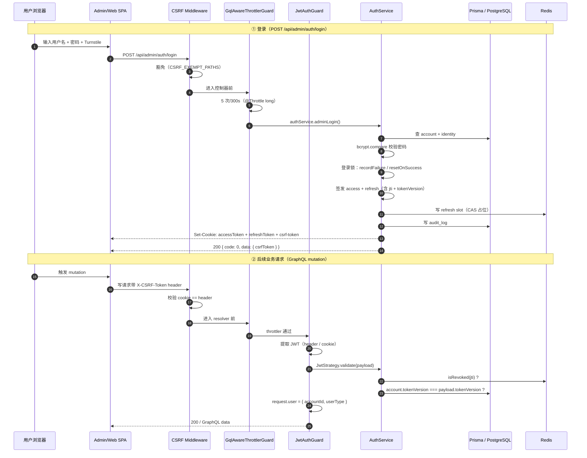
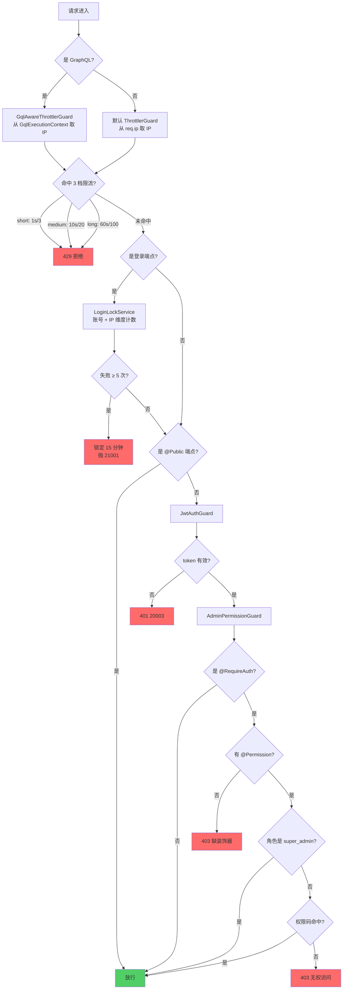
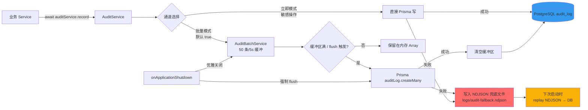
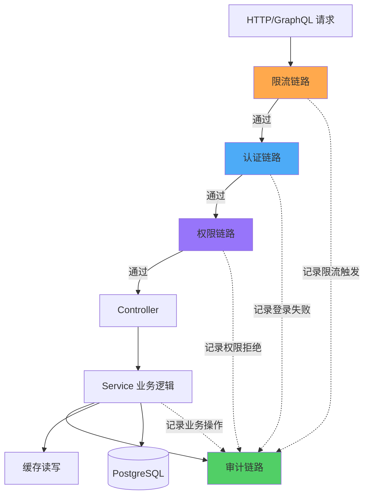

# MonoKit 架构流程图

> **目的**：用 Mermaid 流程图直观展示认证、限流、审计三大核心链路。
> 与 [docs/02-架构总览.md](./02-架构总览.md) 互补：02 讲模块边界，本文讲数据流。

---

## 1. 项目鸟瞰

MonoKit 是 **NestJS 11 后端 + Vue 3 双端 SPA** 的企业级基座。三大基础设施链路（认证 / 限流 / 审计）通过 **app.module.ts** 全局注册，对业务模块透明：

- **认证**：JWT（access 15min + refresh 7d） + httpOnly Cookie + CSRF Double Submit Cookie
- **限流**：3 档 throttler（1s/10s/60s）+ 登录锁（账号 + IP 维度）+ 公开端点白名单
- **审计**：同步写业务上下文 + 50 条/5s 批量 flush + NDJSON 兜底

所有业务模块（admin / member / iam / dashboard）都共用同一套基础设施，业务代码无需感知。

---

## 2. 认证链路（登录 → JWT 签发 → 守卫校验 → Controller）

**关键点**：

- 登录响应一次性下发 **3 个 Cookie**（accessToken + refreshToken + csrf-token）
- 写请求必须带 `X-CSRF-Token` header（前端 `request.ts` 自动注入）
- JWT 校验有两道关：`jti 黑名单` + `tokenVersion 一致性`
- refresh token 通过 Redis Lua 脚本做 CAS 防并发

---

## 3. 限流链路（Throttler → 登录锁 → 公开端点白名单）

**关键点**：

- **3 档限流**：1s/3（防刷）+ 10s/20（防并发）+ 60s/100（防爬）
- **登录锁**独立于 throttler，按账号 + IP 维度记录，5 次失败锁 15 分钟
- **公开端点白名单**：登录 / refresh / logout / csrf-token 等不需要 token
- **超管短路**：super_admin 角色直接放行，绕过所有权限码校验

---

## 4. 审计链路（业务调用 → Audit Service → 批量缓冲 → DB 写 / NDJSON 兜底）

**关键点**：

- **批量缓冲**：默认 50 条 / 5s flush 一次，减少 DB 写压力
- **NDJSON 兜底**：DB 写失败时落到 `logs/audit-fallback.ndjson`，下次启动重放
- **优雅关闭**：`onApplicationShutdown` 触发强制 flush，避免进程被杀丢数据
- **敏感操作走立即模式**：登录失败、改密、软删等关键事件不走批量

---

## 5. 三链路协作

---

## 6. 相关代码

| 链路 | 关键文件 |
|------|----------|
| 认证 | [apps/server/src/modules/auth/auth.service.ts](../apps/server/src/modules/auth/auth.service.ts) / [jwt.strategy.ts](../apps/server/src/modules/auth/jwt.strategy.ts) / [csrf.middleware.ts](../apps/server/src/common/middleware/csrf.middleware.ts) |
| 限流 | [apps/server/src/common/guards/gql-aware-throttler.guard.ts](../apps/server/src/common/guards/gql-aware-throttler.guard.ts) / [login-lock.service.ts](../apps/server/src/modules/auth/login-lock.service.ts) |
| 审计 | [apps/server/src/modules/audit/audit.service.ts](../apps/server/src/modules/audit/audit.service.ts) / [audit-batch.service.ts](../apps/server/src/common/audit/audit-batch.service.ts) |
| 权限 | [apps/server/src/common/guards/admin-permission.guard.ts](../apps/server/src/common/guards/admin-permission.guard.ts) |
