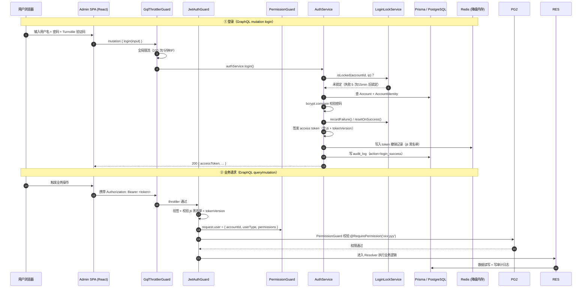
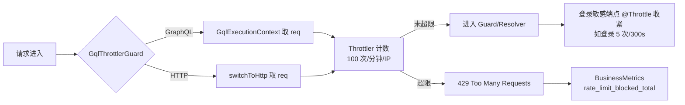
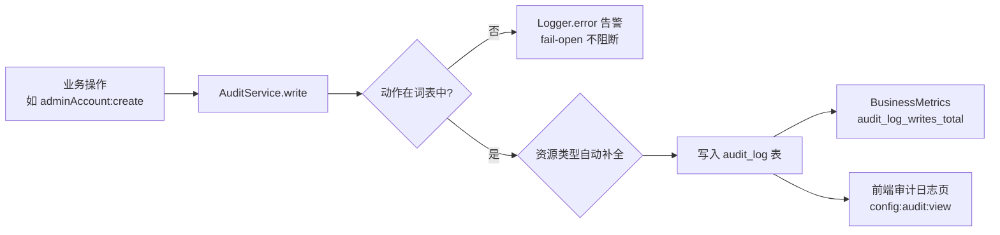
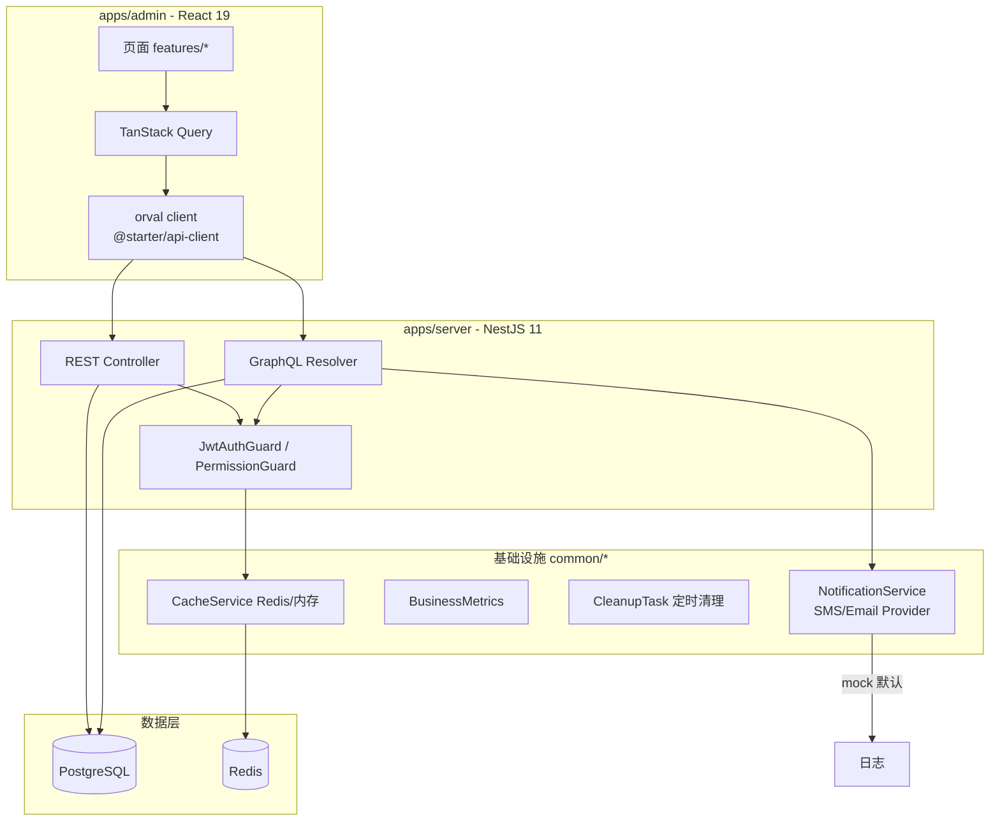
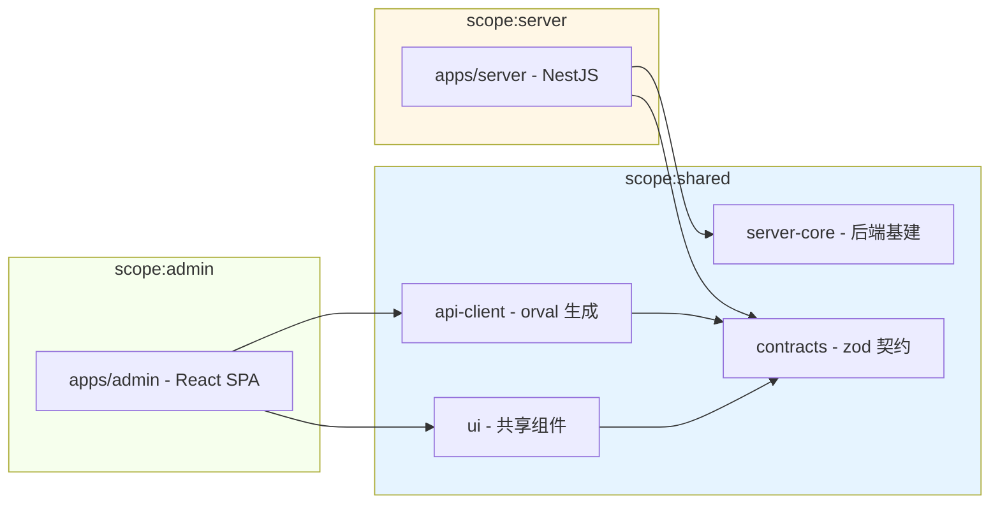
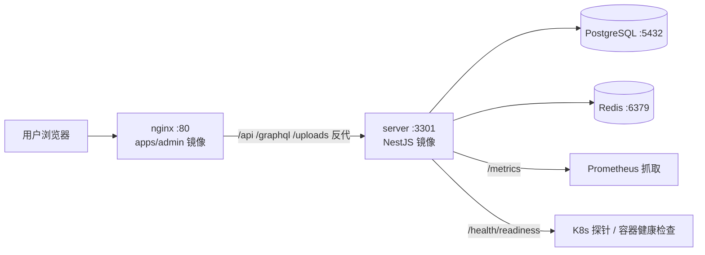

# monorepo-starter 架构流程图

> **目的**：用 Mermaid 流程图直观展示认证、限流、审计三大核心链路与整体架构。
> 与 [docs/用户指南/02-架构总览.md](./用户指南/02-架构总览.md) 互补：用户指南讲模块边界，本文讲数据流。

---

## 1. 项目鸟瞰

monorepo-starter 是 **Nx 23 + pnpm 11 + NestJS 11 后端 + React 19 管理端**的企业级全栈基座。三大基础设施链路（认证 / 限流 / 审计）通过 **apps/server/src/app/app.module.ts** 全局注册，对业务模块透明：

- **认证**：JWT（access token，默认 15min）+ jti 黑名单 + tokenVersion 撤销 + 登录失败锁定（账号 + IP 双维度）
- **限流**：全局 Throttler（100 次/分钟）+ GraphQL 兼容守卫 + 登录敏感端点单独收紧
- **审计**：AuditService 异步写入 audit_log（fail-open 容错，不阻塞主流程）
- **监控**：Prometheus /metrics + 业务指标收集器（登录失败/限流拦截/审计写入/上传计数）
- **数据**：Prisma 7 + PostgreSQL（driver adapter + UUIDv7 主键）
- **API**：Code-First GraphQL 为主 + 少量 REST（认证/上传/健康检查），REST client 由 orval 从 OpenAPI 自动生成

所有业务模块（auth / admin-account / admin-role / admin-menu / audit-log / dashboard / system-* / upload / ws）共用同一套基础设施，业务代码无需感知。

---

## 2. 认证链路（登录 → JWT 签发 → 守卫校验 → Resolver/Controller）

```mermaid
sequenceDiagram
    autonumber
    participant U as 用户浏览器
    participant FE as Admin SPA (React)
    participant RL as GqlThrottlerGuard
    participant JG as JwtAuthGuard
    participant PG as PermissionGuard
    participant AS as AuthService
    participant LL as LoginLockService
    participant PGdb as Prisma / PostgreSQL
    participant RD as Redis (降级内存)

    Note over U,RD: ① 登录（GraphQL mutation login）
    U->>FE: 输入用户名 + 密码 + Turnstile 验证码
    FE->>RL: mutation { login(input) }
    RL->>RL: 全局限流（100 次/分钟/IP）
    RL->>AS: authService.login()
    AS->>LL: isLocked(accountId, ip)？
    LL-->>AS: 未锁定（失败 5 次/15min 后锁定）
    AS->>PGdb: 查 Account + AccountIdentity
    AS->>AS: bcrypt.compare 校验密码
    AS->>LL: recordFailure() / resetOnSuccess()
    AS->>AS: 签发 access token（含 jti + tokenVersion）
    AS->>RD: 写入 token 撤销记录（jti 黑名单）
    AS->>PGdb: 写 audit_log（action=login_success）
    AS-->>FE: 200 { accessToken, ... }

    Note over U,RD: ② 业务请求（GraphQL query/mutation）
    U->>FE: 触发业务操作
    FE->>RL: 携带 Authorization: Bearer <token>
    RL->>JG: throttler 通过
    JG->>JG: 验签 + 校验 jti 黑名单 + tokenVersion
    JG->>PG: request.user = { accountId, userType, permissions }
    JG->>PG2: PermissionGuard 校验 @RequirePermission('xxx:yyy')
    PG2-->>JG: 权限通过
    JG->>RES: 进入 Resolver 执行业务逻辑
    RES->>PGdb: 数据读写 + 写审计日志
```

---

## 3. 限流链路

```mermaid
flowchart LR
    A[请求进入] --> B{GqlThrottlerGuard}
    B -->|GraphQL| C[GqlExecutionContext 取 req]
    B -->|HTTP| D[switchToHttp 取 req]
    C --> E[Throttler 计数<br/>100 次/分钟/IP]
    D --> E
    E -->|未超限| F[进入 Guard/Resolver]
    E -->|超限| G[429 Too Many Requests]
    G --> H[BusinessMetrics<br/>rate_limit_blocked_total]
    F --> I[登录敏感端点 @Throttle 收紧<br/>如登录 5 次/300s]
```

- 全局默认：100 次/分钟/IP（`ThrottlerModule.forRoot`）
- 登录等敏感端点：`@Throttle` 单独收紧
- 登录失败锁定独立于限流：账号 5 次/15min、IP 50 次/15min（阈值可由后台 `settings.loginFailThreshold` 配置）

---

## 4. 审计链路

```mermaid
flowchart LR
    A[业务操作<br/>如 adminAccount:create] --> B[AuditService.write]
    B --> C{动作在词表中?}
    C -->|否| D[Logger.error 告警<br/>fail-open 不阻断]
    C -->|是| E{资源类型自动补全}
    E --> F[写入 audit_log 表]
    F --> G[BusinessMetrics<br/>audit_log_writes_total]
    F --> H[前端审计日志页<br/>config:audit:view]
```

- 动作词表单一事实源：`apps/server/src/modules/auth/audit.constants.ts`（AUDIT_ACTIONS / AUDIT_RESOURCES）
- 新增动作需同步词表与字典（sys_dict 的 audit_action）
- 写失败仅记日志，不阻塞/回滚主流程（fail-open）

---

## 5. 数据流（前端 → API → 数据层）

```mermaid
flowchart TB
    subgraph FE [apps/admin - React 19]
        P[页面 features/*]
        Q[TanStack Query]
        R[orval client<br/>@starter/api-client]
    end
    subgraph API [apps/server - NestJS 11]
        G[GraphQL Resolver]
        H[REST Controller]
        I[JwtAuthGuard / PermissionGuard]
    end
    subgraph INFRA [基础设施 common/*]
        C[CacheService Redis/内存]
        M[BusinessMetrics]
        T[CleanupTask 定时清理]
        N[NotificationService<br/>SMS/Email Provider]
    end
    subgraph DB [数据层]
        PG[(PostgreSQL)]
        RD[(Redis)]
    end

    P --> Q --> R --> G
    R --> H
    G --> I --> C
    H --> I
    G --> PG
    H --> PG
    C --> RD
    G --> N
    N -->|mock 默认| LOG[日志]
```

---

## 6. 模块边界（Nx enforce-module-boundaries）

```mermaid
flowchart LR
    subgraph SHARED [scope:shared]
        CON[contracts - zod 契约]
        SC[server-core - 后端基建]
        API[api-client - orval 生成]
        UI[ui - 共享组件]
    end
    subgraph ADMIN [scope:admin]
        A[apps/admin - React SPA]
    end
    subgraph SERVER [scope:server]
        S[apps/server - NestJS]
    end

    A --> API
    A --> UI
    S --> SC
    S --> CON
    UI --> CON
    API --> CON

    style SHARED fill:#e6f4ff
    style ADMIN fill:#f6ffed
    style SERVER fill:#fff7e6
```

规则（`eslint.config.mjs` + `@nx/enforce-module-boundaries`）：

- `scope:shared` 只能依赖 `scope:shared`
- `scope:admin` 只能依赖 `scope:admin` + `scope:shared`
- `scope:server` 只能依赖 `scope:server` + `scope:shared`
- 禁止 admin 直接 import `@starter/contracts`（必须经 `@starter/api-client` 消费，`no-restricted-imports` 拦截）

---

## 7. 部署拓扑

```mermaid
flowchart LR
    U[用户浏览器] --> NG[nginx :80<br/>apps/admin 镜像]
    NG -->|/api /graphql /uploads 反代| S[server :3301<br/>NestJS 镜像]
    S --> PG[(PostgreSQL :5432)]
    S --> RD[(Redis :6379)]
    S -->|/metrics| PRO[Prometheus 抓取]
    S -->|/health/readiness| K8S[K8s 探针 / 容器健康检查]
```

- 开发编排：`docker compose up -d`（postgres/redis/server/admin/adminer）
- 生产编排：`docker compose -f docker-compose.prod.yml`（read_only + no-new-privileges + 资源限制）
- K8s：`kubectl apply -k k8s/`（HPA + liveness/readiness/startup 三探针 + ingress TLS）
- CI/CD：GitHub Actions（ci → Trivy 扫描 → docs Pages → release GHCR → deploy SSH+回滚）

---

_维护提示：本文档随架构变更更新；链路图对应的代码入口为 `apps/server/src/app/app.module.ts`。_
