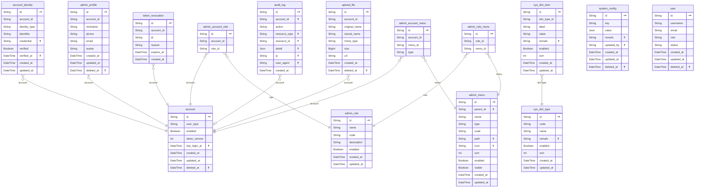

```mermaid
erDiagram

  "account" {
    String id "🗝️"
    String user_type
    Boolean enabled
    Int token_version
    DateTime last_login_at "❓"
    DateTime created_at
    DateTime updated_at
    DateTime deleted_at "❓"
    }


  "account_identity" {
    String id "🗝️"
    String account_id
    String identity_type
    String identifier
    String credential "❓"
    Boolean verified
    DateTime verified_at "❓"
    DateTime created_at
    DateTime updated_at
    }


  "admin_profile" {
    String id "🗝️"
    String account_id
    String nickname
    String phone
    String email
    String avatar
    DateTime created_at
    DateTime updated_at
    DateTime deleted_at "❓"
    }


  "admin_role" {
    String id "🗝️"
    String name
    String code
    String description
    Boolean enabled
    DateTime created_at
    DateTime updated_at
    }


  "admin_menu" {
    String id "🗝️"
    String parent_id "❓"
    String name
    String type
    String code
    String path "❓"
    String icon "❓"
    Int sort
    Boolean enabled
    Boolean visible
    DateTime created_at
    DateTime updated_at
    }


  "admin_role_menu" {
    String id "🗝️"
    String role_id
    String menu_id
    }


  "admin_account_role" {
    String id "🗝️"
    String account_id
    String role_id
    }


  "admin_account_menu" {
    String id "🗝️"
    String account_id
    String menu_id
    String type
    }


  "token_revocation" {
    String id "🗝️"
    String account_id
    String jti
    String reason
    DateTime expires_at
    DateTime created_at
    }


  "audit_log" {
    String id "🗝️"
    String account_id "❓"
    String action
    String resource_type "❓"
    String resource_id "❓"
    Json detail "❓"
    String ip "❓"
    String user_agent "❓"
    DateTime created_at
    }


  "upload_file" {
    String id "🗝️"
    String account_id
    String original_name
    String stored_name
    String mime_type
    BigInt size
    String url
    DateTime created_at
    DateTime deleted_at "❓"
    }


  "sys_dict_type" {
    String id "🗝️"
    String code
    String name
    String remark "❓"
    Boolean enabled
    Int sort
    DateTime created_at
    DateTime updated_at
    }


  "sys_dict_item" {
    String id "🗝️"
    String dict_type_id
    String label
    String value
    String remark "❓"
    Boolean enabled
    Int sort
    DateTime created_at
    DateTime updated_at
    }


  "system_config" {
    String id "🗝️"
    String key
    Json value
    String remark "❓"
    String updated_by "❓"
    DateTime created_at
    DateTime updated_at
    DateTime deleted_at "❓"
    }


  "user" {
    String id "🗝️"
    String username
    String email
    String role
    String status
    DateTime created_at
    DateTime updated_at
    DateTime deleted_at "❓"
    }

    "account_identity" }o--|| account : "account"
    "admin_profile" |o--|| account : "account"
    "admin_role_menu" }o--|| admin_role : "role"
    "admin_role_menu" }o--|| admin_menu : "menu"
    "admin_account_role" }o--|| account : "account"
    "admin_account_role" }o--|| admin_role : "role"
    "admin_account_menu" }o--|| account : "account"
    "admin_account_menu" }o--|| admin_menu : "menu"
    "token_revocation" }o--|| account : "account"
    "audit_log" }o--|o account : "account"
    "upload_file" }o--|| account : "account"
    "sys_dict_item" }o--|| sys_dict_type : "dictType"
```
