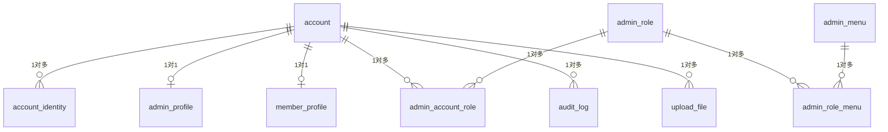

# 数据库 ER 图与 Prisma Studio

> 本文件说明如何用 Prisma Studio 浏览数据库、用 Mermaid 渲染 ER 图、生成数据库关系图。完整的 DDL 设计详见 [数据库设计.md](./数据库设计.md)，迁移流程详见 [数据库.md](./数据库.md)。

## 1. Prisma Studio（推荐）

> Prisma Studio 是 Prisma 自带的可视化数据库浏览器，可以查看、编辑、新增、删除数据。基座项目默认开启。

### 启动

```bash
# 根目录一键启动
pnpm db:studio

# 等价于：
cd apps/server && pnpm exec prisma studio --browser none
```

启动后：

- 浏览器自动打开 `http://localhost:5555`（`--browser none` 时不自动打开，手动访问）
- 默认监听端口：`5555`
- 默认监听地址：`127.0.0.1`（仅本机访问，不暴露给外网）

### 安全提示

> **不要**把 Prisma Studio 暴露到公网。它没有鉴权，任何能访问端口的人都能修改数据。

如果需要在远程服务器查看数据，用 SSH 隧道：

```bash
# 本地执行：把远程 5555 端口映射到本地
ssh -L 5555:127.0.0.1:5555 user@your-server

# 然后本地浏览器打开 http://localhost:5555
```

### 常用操作

| 操作       | 步骤                               |
| ---------- | ---------------------------------- |
| 查看某张表 | 左侧边栏选表名                     |
| 看单条数据 | 点击行                             |
| 编辑数据   | 双击单元格                         |
| 新增数据   | 顶栏 `+ Add record`                |
| 筛选数据   | 顶栏 `Filter`                      |
| 关联数据   | 点击关联字段（如 `accountId`）跳转 |

> 编辑数据会直接写入数据库，没有"撤销"按钮。修改前请确认。

## 2. ER 图（Mermaid）

> 项目的数据库 schema 是基座设计的核心资产，需要清晰的 ER 图辅助理解。

### 生成 ER 图

CI 端 Docs workflow 会自动生成 ER 图并部署到 GitHub Pages。本地手动生成：

```bash
# 方法 1：用 CI 提供的 awk 脚本（fallback）
mkdir -p docs-site/er
awk '
/^model / {
    if (in_model) print "    }"
    in_model = 1
    model_name = $2
    gsub(/\{/, "", model_name)
    print "    " model_name " {"
    next
}
in_model && /^\}/ {
    print "    }"
    in_model = 0
    next
}
in_model && /^[[:space:]]*\/\// { next }
in_model && /^[[:space:]]*\@/ { next }
in_model && /^[[:space:]]*[a-zA-Z_]+/ {
    print "        " $0
}
' apps/server/prisma/schema.prisma > docs-site/er/schema.mmd
```

```bash
# 方法 2：安装 prisma-erd-generator（推荐，生成更专业）
cd apps/server
pnpm add -D prisma-erd-generator

# prisma/schema.prisma 加：
# generator erd {
#   provider = "prisma-erd-generator"
#   output   = "../../docs-site/er/ERD.svg"
#   theme    = "dark"
# }

pnpm exec prisma generate
# → 生成 docs-site/er/ERD.svg
```

### 渲染 Mermaid

Mermaid `.mmd` 文件可以用以下方式渲染：

| 工具                | 用法                                         |
| ------------------- | -------------------------------------------- |
| **GitHub Markdown** | 直接粘贴到 `.md` 文件的 `mermaid` 代码块     |
| **VS Code**         | 安装 "Markdown Preview Mermaid Support" 插件 |
| **Mermaid Live**    | https://mermaid.live/ 直接粘贴               |
| **GitHub Pages**    | CI 自动渲染（如果配了 mermaid.js）           |

## 3. 数据库结构总览

> 完整 DDL 和权威定义见 [数据库设计.md](./数据库设计.md)。本节只列分组和代表字段。

### 18 张表

| 分组            | 表名                                                                       | 用途                                                     |
| --------------- | -------------------------------------------------------------------------- | -------------------------------------------------------- |
| **认证层**      | `account`                                                                  | 统一账户表（admin / member 共用，通过 `user_type` 区分） |
|                 | `account_identity`                                                         | 第三方登录身份（手机号 / 邮箱 / OAuth）                  |
|                 | `admin_profile`                                                            | 管理端扩展信息（部门、职位等）                           |
|                 | `member_profile`                                                           | C 端扩展信息（昵称、头像、性别、生日）                   |
| **管理端 RBAC** | `admin_role`                                                               | 管理端角色                                               |
|                 | `admin_menu`                                                               | 管理端菜单（含按钮）                                     |
|                 | `admin_account_role`                                                       | 账户-角色关联                                            |
|                 | `admin_role_menu`                                                          | 角色-菜单关联                                            |
|                 | `admin_account_menu`                                                       | 账户-菜单直接授权（特殊场景）                            |
| **C 端 RBAC**   | `member_role` / `member_menu` / `member_account_role` / `member_role_menu` | C 端 RBAC（与管理端对称）                                |
| **审计日志**    | `audit_log`                                                                | 关键操作审计                                             |
| **文件管理**    | `upload_file`                                                              | 上传文件元数据                                           |
| **系统配置**    | `system_config`                                                            | 动态配置项（管理后台可改）                               |
|                 | `verification_code`                                                        | 验证码（手机 / 邮箱）                                    |

### 核心关系（简化版）



> **注**：Mermaid 关系符号：`||--o{` 表示 1 对多，`||--o|` 表示 1 对 1。

## 4. 常用数据库命令

```bash
# 启动 Prisma Studio（数据库浏览器）
pnpm db:studio

# 创建并应用 migration（开发环境）
pnpm db:migrate

# 重新生成 Prisma Client（修改 schema 后）
pnpm db:generate

# 格式化 schema.prisma
pnpm db:format

# 检查 schema 格式（pre-commit 自动调用）
pnpm db:format:check

# 检查 migration_lock.toml 是否正确
pnpm db:check
```

## 5. 故障排查

### Studio 启动失败：端口占用

```bash
# 查找占用 5555 端口的进程
lsof -i:5555

# 结束它
kill -9 <PID>
```

### Studio 启动失败：数据库连接错误

```bash
# 检查 .env 文件
cat apps/server/.env | grep DATABASE_URL

# 确认数据库可访问
psql "$DATABASE_URL" -c "SELECT 1"

# 启动 docker-compose 数据库
docker compose up -d postgres
```

### 修改 schema 后没生效

```bash
# 1. 格式化 schema
pnpm db:format

# 2. 生成 migration
pnpm db:migrate --name <migration_name>

# 3. 重新生成 Prisma Client
pnpm db:generate
```

### ER 图没有生成

```bash
# 检查 prisma-erd-generator 是否安装
pnpm -F @apps/server list prisma-erd-generator

# 如果没有，安装
pnpm --filter @apps/server add -D prisma-erd-generator

# 配置 generator 块到 schema.prisma
# 详见上方「生成 ER 图」方法 2
```

## 6. 延伸阅读

- [数据库设计.md](./数据库设计.md) — 18 张表 DDL、字段类型、索引策略
- [数据库.md](./数据库.md) — migration 流程、lock 文件、CI 检查
- [权限控制.md](./权限控制.md) — RBAC 表关系详解
- [Prisma 官方文档](https://www.prisma.io/docs/orm/prisma-client) — Prisma Client API
